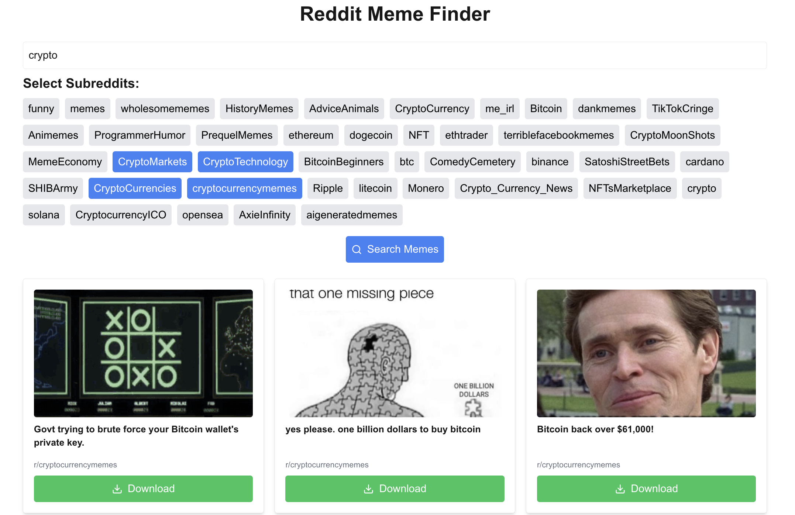
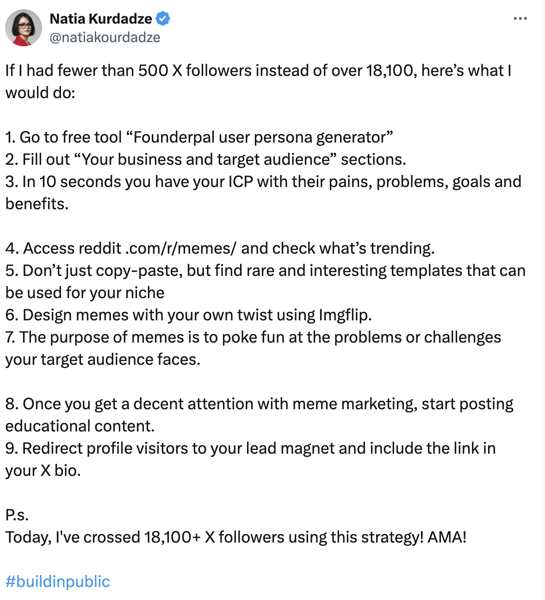

# Reddit Meme Finder

Reddit Meme Finder is a tool that helps you discover and download relevant memes from various subreddits based on your search query. It uses OpenAI's GPT-3.5-turbo model to analyze the relevance of memes to your search terms.



## Inspiration

This project was inspired by a tweet from Natia Kurdadze (@natiakourdadze) outlining a strategy for growing a social media following using memes and targeted content. The tweet describes a process of identifying your target audience, finding relevant memes, and using them to build engagement before transitioning to educational content. My tool automates part of this process, making it easier to find and utilize relevant memes for your content strategy.



## Features

- Search memes across multiple subreddits
- Analyze meme relevance using AI
- Download memes directly from the interface
- Customizable subreddit list for different industries or interests

## Prerequisites

Before you begin, ensure you have met the following requirements:

- Node.js (v14 or later)
- npm (v6 or later)
- A Reddit account and API credentials
- An OpenAI API key

## Installation

1. Clone the repository:
   ```
   git clone https://github.com/plotj/reddit-meme-finder.git
   cd reddit-meme-finder
   ```

2. Install the dependencies:
   ```
   npm install
   ```

3. Create a `.env.local` file in the root directory and add your API keys:
   ```
   REDDIT_CLIENT_ID=your_reddit_client_id
   REDDIT_CLIENT_SECRET=your_reddit_client_secret
   REDDIT_USERNAME=your_reddit_username
   REDDIT_PASSWORD=your_reddit_password
   OPENAI_API_KEY=your_openai_api_key
   ```

## Usage

1. Start the development server:
   ```
   npm run dev
   ```

2. Open your browser and navigate to `http://localhost:3000`

3. Enter your search query and select the subreddits you want to search

4. Click "Search Memes" to find relevant memes

5. Use the "Download" button to save memes you like

## Customizing for Your Industry

You can easily customize the Reddit Meme Finder for your specific industry or interests by modifying the list of subreddits in the `src/app/api/memes/route.ts` file:

1. Open `src/app/api/memes/route.ts`

2. Find the `popularMemeSubreddits` array

3. Add or remove subreddits relevant to your industry. For example, if you're in the tech industry, you might add:
   ```typescript
   const popularMemeSubreddits = [
     // ... existing subreddits ...
     'programming', 'ProgrammerHumor', 'techhumor', 'softwaregore',
     'machinelearningmemes', 'AIfreakout', 'data_irl'
   ];
   ```

4. Save the file and restart the development server

By customizing this list, you can tailor the tool to find memes specific to your industry or interests.

## Contributing

Contributions to the Reddit Meme Finder are welcome. Please feel free to submit a Pull Request.

## License

This project is licensed under the MIT License - see the LICENSE file for details.


## Disclaimer

This tool is for educational purposes only. Ensure you comply with Reddit's API terms of service and respect copyright when using and sharing memes.